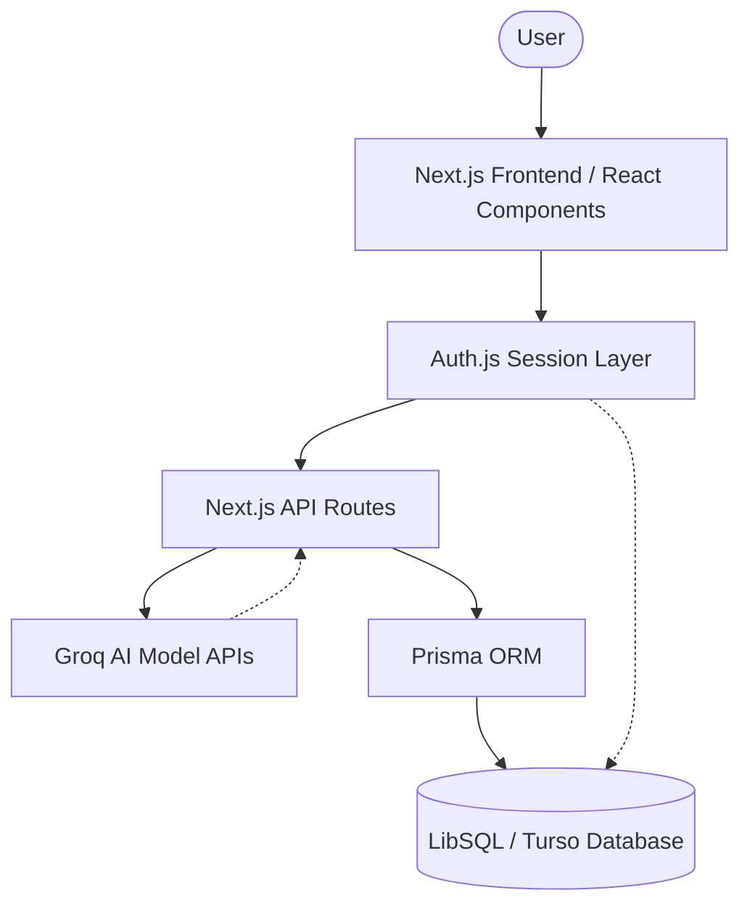

# AI-Powered Expense Tracker

An intelligent and beautiful application designed to manage your personal finances, specifically built to track spending, income, bills, and debts, while making use of an AI assistant to easily process transactions from conversations.

## Overview

This project provides a robust solution to modern financial tracking. By conversing with an intelligent AI chatbot, users can get onboarding out of the way, add expenses seamlessly, and stay on top of their financial habits. Complete with a rich dashboard charting expenses and goal progression, managing money has never been easier.

## Features

- **Conversational Onboarding**: Let the Groq-powered AI ask exactly what it needs to set up an initial layout of your finances.
- **Smart Transactions Tracking**: Log expenses using natural language. Let the AI process it directly to your databases.
- **Comprehensive Dashboards**: Track incomes vs expenses, budget ceilings, and categorized spending at a glance.
- **Debt & Bill Management**: Manage credit card bills, EMIs, custom loans with tracking records to mark dues as "paid".
- **Real-Time Data Sync**: Fast, efficient updates and mutations powered by Next.js Server Actions and APIs with SQLite edge-compatible databases.

## Tech Stack

The core foundation relies on the robust combination of modern server-rendering and reactive user interfaces alongside a lightweight SQLite setup.

- **Next.js 16+ (App Router)** - React framework for UI composition, routing, and APIs.
- **React 19** - Next-generation hook APIs and concurrent rendering.
- **Tailwind CSS v4** - Styling framework for atomic, flexible UI.
- **Prisma & LibSQL/Turso** - ORM bridging data securely to edge SQLite databases.
- **Auth.js v5 (NextAuth)** - Secure, session-based user authentication.
- **Recharts** - Dynamic financial data visualization.
- **Framer Motion & tsParticles** - Smooth, modern UI animations.
- **Groq SDK** - Fast inference API connecting powerful language models.

## Project Structure

```text
expense-tracker/
├── app/                  # Next.js App Router root (Pages, Layouts, API routes)
│   ├── api/              # Secure Next.js Server API Endpoints (Auth, AI, DB mutations)
│   ├── dashboard/        # Dashboard module (including Debts, Transactions, Overview)
│   └── ...               # Public routes and landing pages
├── components/           # Reusable React components (UI elements, forms, charts, layouts)
├── lib/                  # Utility functions and shared library code (Prisma client)
├── prisma/               # Prisma schema and SQLite database migrations (.db)
├── public/               # Static web assets (images, fonts, scripts)
├── .env                  # Environment variables
├── next.config.ts        # Next.js typed configuration
├── package.json          # Project dependencies and deployment scripts
└── README.md             # Project documentation
```

## Architecture



## Deployment Guide

### 1. Push to GitHub
1. Initialize your local Git repository if you haven't already:
   ```bash
   git init
   git add .
   git commit -m "Initial commit for Expense Tracker"
   ```
2. Create a new repository on [GitHub](https://github.com/).
3. Link your remote repository and push changes:
   ```bash
   git remote add origin https://github.com/<your-username>/expense-tracker.git
   git branch -M main
   git push -u origin main
   ```

### 2. Deploy on Vercel
Deployment with Vercel is highly streamlined for Next.js projects:
1. Log in to [Vercel](https://vercel.com/) and click **Add New** -> **Project**.
2. Continually Authorize GitHub and find the `expense-tracker` repository you just pushed.
3. Click **Import**.
4. In the Project details, **Environment Variables** are crucial. Ensure you securely paste the variables found in your `.env` file! At a basic level, you might need:
   - `NEXTAUTH_SECRET`
   - `NEXTAUTH_URL`
   - Data Connection URLs (`DATABASE_URL`) via remote LibSQL/Turso. If you're using a local file like `dev.db`, you must migrate this to a Turso database URL for cloud/serverless deployments.
   - `GROQ_API_KEY`
5. Click **Deploy**. Vercel will install dependencies, build the project with `Next.js`, and grant you a public URL for your project!

## Getting Started Locally

Install dependencies and start development:

```bash
npm install
npm run dev
```

Open [http://localhost:3000](http://localhost:3000) to see the result.
